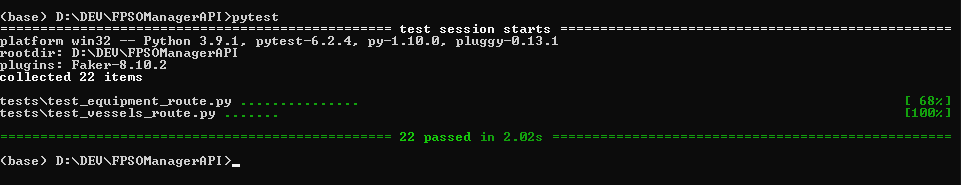

# FPSOManagerAPI
Python backend to manage different equipment of an FPSO.

- [FPSOManagerAPI](#fpsomanagerapi)
  - [Packages Used](#packages-used)
  - [Project Set up](#project-set-up)
    - [Run without installing](#run-without-installing)
    - [Installing the application](#installing-the-application)
  - [Usage](#usage)
  - [Tests](#tests)

## Packages Used
* [FastAPI](https://fastapi.tiangolo.com/) - Web Framework for building APIs.
* [uvicorn](https://www.uvicorn.org/) - ASGI (Asynchronous Server Gateway Interface) server implementation.
* [pydantic](https://pydantic-docs.helpmanual.io/) - API Schema validation, automatic serialize and deserialize jsons and settings management using python type annotations.
* [SQLalchemy](https://www.sqlalchemy.org/) - ORM (Object Relational Mapper) used for database communication
* [SQLite](https://www.sqlite.org/index.html) - Small SQL database engine used for data persistence
* [pytest](https://pytest.org) - Testing Framework
* [Faker](https://faker.readthedocs.io/en/master/) - Fake data generation for tests


## Project Set up

### Run without installing
1. Install requirements:
   ```sh
   pip install -r requirements.txt
   ```
2. Run the application:
   ```sh
   python main.py
   ```

### Installing the application
1. Install the application:
   ```sh
   pip install .
   ```
2. Run the application:
   ```sh
   fpso-manager
   ```
## Usage

The API runs by default at <http://localhost:8000>

When the application is runinng, the Swagger documentation for the API is located at <http://localhost:8000/docs> .


The Swagger documentation contains all endpoints' schemas and possible responses. It also allows to try the requests.


## Tests

To run the tests, execute ```pytest``` from the repositorie root

